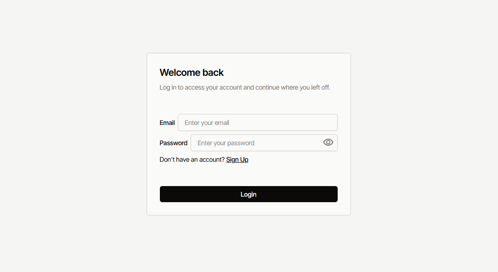

# 📝 Login/Sign Up Page - Javascript + Tailwind CSS + Node Js

Este é um projeto de **Login/Sign Up** feito com **Javascript + Tailwind CSS + Node Js**, com suporte a:

- ✅ Registro e login de usuários
- 🔒 Validação de dados no front-end e back-end
- 🧱 Modularização do servidor com rotas, controladores e serviços
- 🌐 Interface responsiva com Tailwind CSS
- 💾 Armazenamento seguro no PostgreSQL (via pg)
- ☁️ Backend deployado via Railway e banco no Render
- 🌐 Deploy via GitHub Pages

 <!-- opcional, se quiser colocar uma imagem -->

---

## 🚀 Deploy

Acesse o projeto online:  
👉 [https://byruzie.github.io/login-js/](https://byruzie.github.io/login-js/)

---

## 🧰 Tecnologias usadas

- JavaScript (vanilla)
- TailwindCSS
- Node.js
- Express
- PostgreSQL
- Render (banco de dados)
- Railway (backend)

---

## 🧠 Aprendizados

- Criação de autenticação do zero, controlando lógica de login e registro tanto no front quanto no back.
- Organização de um servidor Express de forma modular, separando responsabilidades em controladores, rotas e serviços.
- Conexão com banco de dados PostgreSQL hospedado na nuvem, usando o pacote pg e variáveis de ambiente.
- Deploy de aplicações fullstack, aprendendo a integrar hospedagem de banco (Render) com servidor (Railway).
- Tailwind na prática, aplicando utilitários para criar uma interface clara, moderna e adaptável a diferentes tamanhos de tela.
- Manipulação e validação de formulários, feedback visual em tempo real e mensagens de erro amigáveis.

---

## 🙋‍♂️ Autor

Desenvolvido por Raul Cardoso
